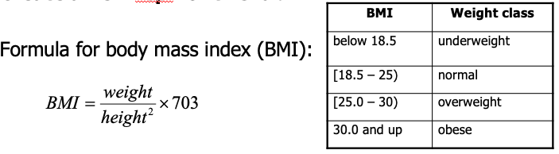

# BMI Calculator Lab
Formula for body mass index (BMI):



- Write a program that takes input using the Scanner class. 
The output should produce the user's BMI on one line and the user's 
weight class on a separate line.

- Typical output might look something like the following. Note: the first two
lines are for communicating and reading in user input.


- You must use the following two methods. The `bmi` method takes two doubles
and returns a double for the BMI value. The `weightClass` takes two doubles
and returns a String for the weight class based on the BMI.  **The `weightClass`
method must call the `bmi` method.**

You will need to complete the two methods below and the main method 
to create the Scanner input object and read the values.
```
public static double bmi(double height, double weight){

        return 0.0;
    }
public static String weightClass(double height, double weight){

        return "";
    }
```


